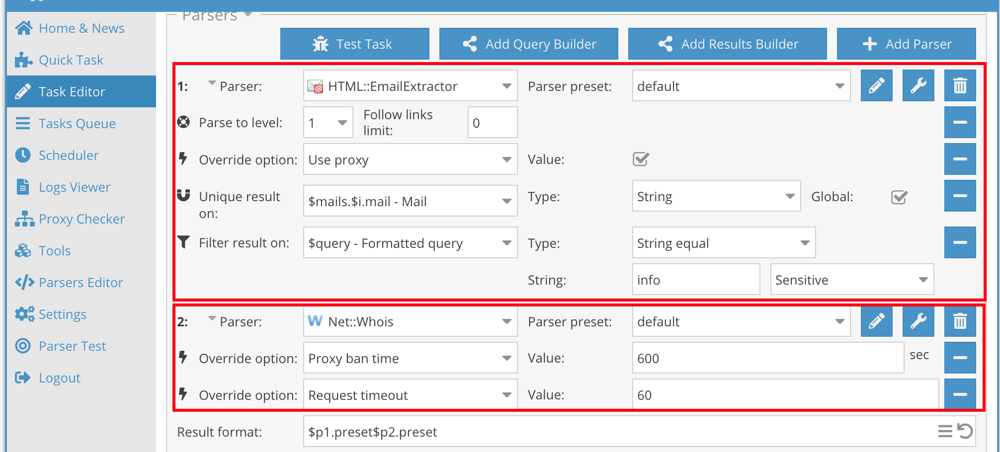
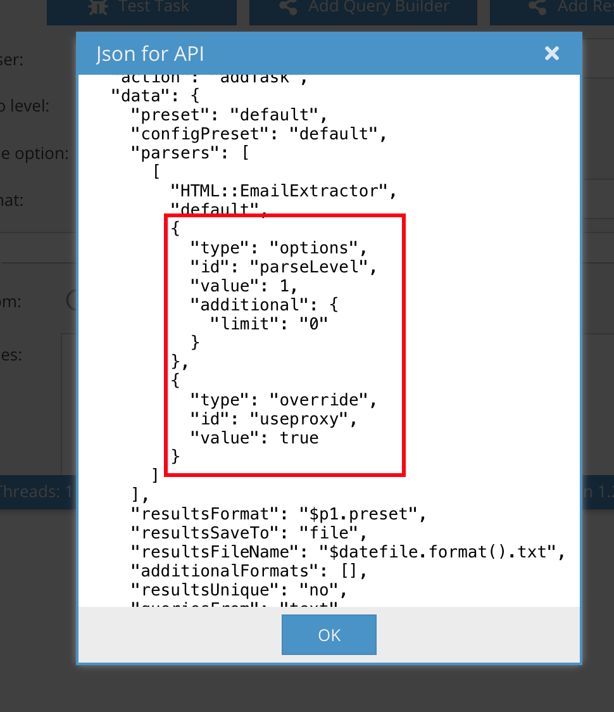

# A-Aparser PHP API
This A-parser PHP API library provides convenient access to the [A-Parser HTTP API](https://en.a-parser.com/docs/api/overview).

## Requirements
- php >= 8.1
- guzzlehttp/guzzle >= 7.0

## Installation
```shell 
composer require reset-button/a-parser-php-client
``` 

## Quickstart
```php
//Define an a-parser instance
$aparser = new \ResetButton\AparserPhpClient\Aparser('http://full_url_to_api_endpoint','password');

//Define an action from https://en.a-parser.com/docs/api/methods
$taskConfAction = new \ResetButton\AparserPhpClient\Actions\GetTaskConfAction(1);

//Run the action and get the result
$result = $aparser->runAction($action);
```
## Usage
### Basic Action Usage
Define an A-parser instance, passing full URL to API endpoint and password
```php
//Define an a-parser instance
$aparser = new \ResetButton\AparserPhpClient\Aparser('full_url_to_api_endpoint','password');
```
Instantiate an action using the appropriate action class, as outlined in the official documentation 
```php
$taskConfAction = new \ResetButton\AparserPhpClient\Actions\GetTaskConfAction(1);
```
Run the action by calling `runAction` method
```php
$result = $aparser->runAction($action);
```
### Using Parser class in Actions

All actions that accept parser name and config as parameter, accept a `Parser` instance instead (addTask, oneRequest, bulkRequest, getParserPreset, getParserInfo)

`Parser` class contains all logic, related to used parser in API methods, that used it



In minimal approach you need only to create `Parser` instance without any configuration and pass it to corresponding method

```php
$parser = new \ResetButton\AparserPhpClient\Parser('HTML::EmailExtractor','parser preset, if differs from default');
$action = new \ResetButton\AparserPhpClient\Actions\GetParserInfoAction($parser);
```

You can configure parser with options, overrides, etc before passing it to action by calling corresponding methods 
```php
$parser->addOption('parseLevel', '1', ["limit" => 0]);
$parser->addOverride('useproxy', false);
```

Or you can set full configuration at once using a corresponding method, this is useful when copy pasting from API request



```php
$parser->setConfiguration([
    [
        "type" => "options", 
        "id" => "parseLevel", 
        "value" => 1, 
        "additional" => [
          "limit" => "0" 
        ] 
    ], 
    [
      "type" => "override", 
      "id" => "useproxy", 
      "value" => true 
    ] 
]);
```
> Note, that parser configuration has no effect in `getParserPreset` and `getParserInfo` actions.

### Configuring Actions

All action required parameters are configured via constructor, and optional are set using builder pattern with corresponding parameters from the documentations with "set" prefix, for example
```php
//Example 1
$action = new \ResetButton\AparserPhpClient\Actions\GetProxiesAction();
$action->setCheckers(['premium']); //set checkers parameter

//Example 2
$parser = new \ResetButton\AparserPhpClient\Parser('HTML::EmailExtractor','parser preset, if differs from default');
$action = new \ResetButton\AparserPhpClient\Actions\OneRequestAction($parser,'https://a-parser.com');
$action->setRawResults(true);
$action->setDoLog(false);
```
#### Configuring `addTask` action
This method is differs from others methods, it can be instantiated via passing at least one parser or passing a [previously saved preset](https://a-parser.com/docs/api/methods#starting-a-previously-saved-task), this two methods are implemented via named constructor

```php
$parser = new \ResetButton\AparserPhpClient\Parser('HTML::EmailExtractor');
$actionViaParser = \ResetButton\AparserPhpClient\Actions\AddTaskAction::withParser($parser, ['query1']);
$actionViaPreset = \ResetButton\AparserPhpClient\Actions\AddTaskAction::withPreset('savedPreset', ['query1']);
```
Also, `addTask` action is a most complex action in API, so many setters for are not implemented and you should use `setDataValue` from [Link to Header](#Direct Action Methods) to set parameters  
```php
$actionViaPreset = \ResetButton\AparserPhpClient\Actions\AddTaskAction::withPreset('savedPreset', ['query1']);
$actionViaPreset->setResultsUnique(); //Use setter
$actionViaPreset->setDataValue("saveFailedQueries", true); //Setter for this option is missing, using direct method
```
##### Setting queries source
You should pass queries when creating action, no matter the source. And then change queries source using `setQueriesFrom...` methods, default behavior is from **text**.

```php
$fromText = \ResetButton\AparserPhpClient\Actions\AddTaskAction::withPreset('savedPreset', ['query1', 'query1']);

$fromFile = \ResetButton\AparserPhpClient\Actions\AddTaskAction::withPreset('savedPreset', ['filename1.txt', 'filename2.txt']);
$fromFile->setQueriesFromFiles();

//If you need change source again to text use
// $fromFile->setQueriesFromText();
```

#### Action Direct Methods

You can read any configuration option using `getDataValue` helper, if this option is not exists - null will returned
```php
$taskConfAction = new \ResetButton\AparserPhpClient\Actions\GetTaskConfAction(1);
$taskConfAction->getDataValue("taskUid"); //will return 1
$taskConfAction->getDataValue("taskWrongUid"); //will return null
```
You can directly set/overwrite any configuration option using `setDataValue` helper. Use with caution.
```php
$taskConfAction = new \ResetButton\AparserPhpClient\Actions\GetTaskConfAction(1);
$taskConfAction->setDataValue("taskUid", 10); 
$taskConfAction->getDataValue("taskUid"); //will return 10
```
You can get all full configuration options using `getData` helper.
```php
$parser = new \ResetButton\AparserPhpClient\Parser("SE::Google")
$parserPresetAction = new \ResetButton\AparserPhpClient\Actions\GetTaskConfAction($parser);
$taskConfAction->getData(); //will return ["parser" => "SE::Google", "preset": "default"]
```

### Aparser methods

Instantiate A-parser instance by passing URL to API endpoint and password
```php
$aparser = new \ResetButton\AparserPhpClient\Aparser('http://full_url_to_api_endpoint','password');
```
Prepare actions and run it by calling `runAction` method
```php
$pingAction = new \ResetButton\AparserPhpClient\Actions\PingAction();
$getProxiesAction = new \ResetButton\AparserPhpClient\Actions\GetProxiesAction();
$resultPing = $aparser->runAction($pingAction);
$resultGetProxies = $aparser->runAction($getProxiesAction);
````
`runAction` will return `data` section from A-parser success response payload or throw a `AparserApiException` if A-parser responds with error

You can get JSON string from passed action using `getJsonString` helper.
```php
$aparser->getJsonString($getPingAction); //will return something like {"password": "pass","action": "ping"}
```

At last, you can just copy JSON query from A-parser and send it via API directly even ignoring previously passed password 
```php
$jsonString = '{ "password": "pass", "action": "ping" }';
$aparser->runJsonString($jsonString);
```

## License

This package is open-sourced software licensed under the [MIT license](https://opensource.org/licenses/MIT).